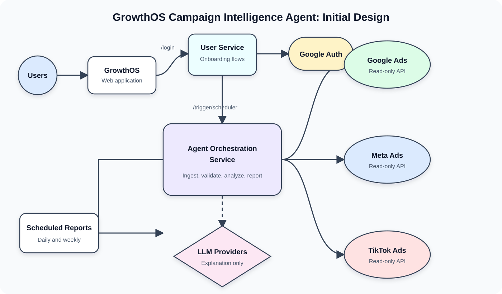

# GrowthOS Multi-Provider Campaign Intelligence Agent

## Implementation Plan

**Status:** Proposed MVP architecture  
**Primary audience:** Engineering, product, security, and operations  
**Providers in target design:** Google Ads, Meta Ads, and TikTok Ads  
**First implementation milestone:** Google Ads  
**Initial mode:** Read-only campaign reporting and analysis

## 1. Objective

GrowthOS will allow an authorized employee of a US restaurant chain to sign in, connect the chain's Google Ads, Meta Ads, and TikTok Ads accounts, and receive recurring analysis of marketing spend and campaign performance.

The first release will:

- Authenticate GrowthOS users with Google through Supabase Auth.
- Create or join a restaurant organization during onboarding.
- Connect advertising providers through separate provider authorization flows.
- Retrieve campaign data on a schedule using read-only access.
- Store raw and normalized campaign data by organization and advertising account.
- Calculate performance changes and anomalies deterministically.
- Use an agent to explain validated findings in business language.
- Publish daily alerts and weekly reports in GrowthOS.

The first release will not modify campaigns, budgets, bids, creatives, or account settings.

## 2. Source Flow

The updated [Excalidraw diagram](https://excalidraw.com/#json=n9WdP2F0fAnz5mVcQylF9,3WausbL5B8R0ptXMuvbZ7Q) describes this high-level flow:



```text
Restaurant user
    |
    v
GrowthOS web application
    |
    +--> /login
    |       |
    |       v
    |   User / Onboarding Service
    |       |
    |       +--> Google Authentication
    |       |
    |       v
    +--> /trigger/scheduler
            |
            v
        Agent Orchestration Service
            |
            +--> Google Ads
            +--> Meta Ads
            +--> TikTok Ads
            +--> LLM providers
            |
            v
        Scheduled reports
```

The diagram presents the orchestration service as the central coordinator. In implementation, it must use durable jobs and persistence boundaries: provider data is fetched, stored, normalized, and validated before findings are sent to an LLM. The LLM explains evidence; it does not directly operate provider accounts or calculate authoritative metrics.

## 3. Important Authentication Distinction

There are two independent categories of authorization flow.

### GrowthOS login

Google login identifies the person using GrowthOS. It does not grant Google Ads access.

```text
User -> Supabase Auth -> Google Identity -> GrowthOS session
```

### Advertising-provider connections

Google Ads, Meta Ads, and TikTok Ads each require separate provider consent. These connections grant GrowthOS access to selected advertising accounts and happen only after the user is authenticated and authorized as an organization owner or administrator.

```text
Organization admin -> GrowthOS integration flow -> Provider OAuth
                   -> encrypted provider credential -> selected ad accounts
```

The two token types must be stored and handled separately.

## 4. Target Architecture

```text
Browser
  |
  v
GrowthOS Control Plane API
  |-- User and organization onboarding
  |-- Provider connection management
  |-- Report and sync-status APIs
  |
  +--> Supabase Auth
  +--> Secret Manager
  +--> PostgreSQL
  +--> Job Queue
          |
          v
      Scheduler / Workers
          |-- Provider-specific ingestion
          |-- Data validation
          |-- Deterministic analysis
          |-- Agent report generation
          |
          +--> Google Ads, Meta Ads, and TikTok Ads APIs
          +--> Private raw object storage
          +--> PostgreSQL normalized data
          +--> Vertex AI or deterministic fallback
```

### Design rules

1. The web application never receives provider refresh or access tokens.
2. The agent never calls advertising platforms directly or owns credentials.
3. Workers retrieve data and write normalized records before analysis begins.
4. Application code calculates metrics and findings; the model explains them.
5. Every record, job, finding, and report is scoped to an organization.
6. Every report includes account coverage, attribution settings, reporting period, and data freshness.

## 5. Domain Model

The ownership hierarchy is:

```text
Organization
  -> Organization members
  -> Brands
  -> Restaurant locations
  -> Provider connections
  -> Provider advertising accounts
  -> Campaign data
  -> Analysis reports
```

### Required tables

#### `organizations`

- `id`
- `name`
- `timezone`
- `currency`
- `created_at`

#### `organization_members`

- `organization_id`
- `user_id`
- `role`: `owner`, `admin`, `analyst`, or `viewer`
- `created_at`

#### `brands`

- `id`
- `organization_id`
- `name`
- `timezone`

#### `locations`

- `id`
- `brand_id`
- `name`
- `address`
- `timezone`
- `external_identifiers`

#### `provider_connections`

- `id`
- `organization_id`
- `provider`
- `status`
- `credential_ref`
- `token_expires_at`
- `last_validated_at`
- `last_error_code`

#### `provider_accounts`

- `id`
- `connection_id`
- `organization_id`
- `external_customer_id`
- `manager_customer_id`
- `name`
- `currency`
- `timezone`
- `selected`

#### Campaign entities

- `campaigns`
- `campaign_groups`
- `ads`
- `creatives`
- `campaign_daily_metrics`
- `group_daily_metrics`
- `ad_daily_metrics`

Every campaign entity includes `organization_id`, `provider_account_id`, an external ID, status, provider timestamps, and a private raw-payload reference.

#### Operational entities

- `jobs`
- `sync_runs`
- `data_quality_issues`
- `analysis_findings`
- `analysis_reports`
- `report_deliveries`

## 6. User And Onboarding Service

### Login flow

1. The browser requests `GET /api/auth/config`.
2. The user selects **Continue with Google**.
3. Supabase Auth redirects to Google Identity.
4. Google redirects back to the configured GrowthOS callback.
5. The browser receives a Supabase session.
6. API requests include `Authorization: Bearer <access-token>`.
7. The API verifies the token using `auth.getUser`.
8. The API loads organization memberships for the verified user ID.

### First-login onboarding

1. Create a user profile if one does not exist.
2. Ask the user to create an organization or accept an invitation.
3. Capture the restaurant chain name, brands, locations, timezone, and reporting preferences.
4. Assign the creator the `owner` role.
5. Prompt an owner or admin to connect Google Ads.

### Required APIs

```text
GET  /api/me
GET  /api/organizations
POST /api/organizations
POST /api/organizations/:id/invitations
POST /api/invitations/:token/accept
GET  /api/organizations/:id/onboarding
PUT  /api/organizations/:id/onboarding
```

### Authorization middleware

Every organization-scoped endpoint must:

1. Verify the Supabase user.
2. Resolve the organization from a path, header, or server-side session.
3. Verify membership.
4. Verify role for privileged operations.
5. pass a trusted `organizationId` to downstream code.

Client-provided organization, brand, account, or report IDs are identifiers, not authorization proof.

## 7. Google Ads Integration

### Minimum access

Request the Google Ads read-only scope needed to retrieve reporting data. Do not request campaign-management access for the reporting MVP.

The Google Ads API also requires:

- An approved Google Ads developer token.
- A Google Cloud OAuth client.
- Customer consent.
- A login customer ID when accessing accounts through a manager account.

### Connection APIs

```text
POST   /api/organizations/:id/integrations/google-ads/start
GET    /api/integrations/google-ads/callback
GET    /api/organizations/:id/integrations/google-ads/accounts
PUT    /api/organizations/:id/integrations/google-ads/accounts
DELETE /api/organizations/:id/integrations/google-ads
```

### OAuth implementation

1. Confirm that the user is an organization owner or admin.
2. Generate a short-lived, signed, single-use OAuth state containing a connection-intent ID.
3. Store the intent with organization, user, redirect target, expiry, and PKCE data where applicable.
4. Redirect to Google consent.
5. Validate state and expiry in the callback.
6. Exchange the authorization code server-side.
7. Store the refresh token in Secret Manager.
8. Store only its secret reference in `provider_connections`.
9. Discover accessible customer accounts.
10. Require explicit account selection.
11. Queue an account metadata sync and 90-day historical backfill.

### Provider adapter

```javascript
class GoogleAdsAdapter {
  exchangeAuthorizationCode(input) {}
  listAccessibleCustomers(connection) {}
  validateConnection(connection) {}
  fetchAccountMetadata(account) {}
  fetchCampaignEntities(account, cursor) {}
  fetchDailyInsights(account, range, cursor) {}
}
```

The adapter must return provider-independent result envelopes with records, pagination state, request identifiers, and freshness timestamps.

## 8. Scheduling And Job Orchestration

The `/trigger/scheduler` label in the diagram should not be a public endpoint that performs all work synchronously. It should create durable jobs and return quickly.

### Job types

```text
google_ads_account_discovery
google_ads_historical_backfill
google_ads_incremental_sync
validate_campaign_data
generate_campaign_findings
generate_analysis_report
deliver_analysis_report
validate_provider_connection
```

### Proposed cadence

- Incremental campaign sync every six hours.
- Connection validation every 24 hours.
- Daily anomaly analysis after the final daily sync.
- Weekly executive report on Monday morning in the organization's timezone.
- Immediate operational alert after repeated sync or authentication failures.

### Job lifecycle

```text
pending -> running -> succeeded
                  -> retryable -> pending
                  -> failed -> dead letter
```

Each job requires:

- Organization scope.
- Provider account scope.
- An idempotency key.
- Attempt count and maximum attempts.
- Scheduled, started, and completed timestamps.
- Structured error code.
- Locked-at and worker identifiers.

Example idempotency key:

```text
google-ads:{customerId}:daily-metrics:2026-08-01:2026-08-07
```

### Trigger security

- Cloud Scheduler authenticates to a private scheduler endpoint using service identity.
- Browser users cannot invoke global scheduled processing.
- Manual sync requests require an authorized organization role and create organization-scoped jobs.
- Workers atomically claim jobs to prevent duplicate execution.

## 9. Google Ads Ingestion

### Initial objects

- Customer account metadata.
- Campaigns.
- Ad groups.
- Ads and creative metadata.
- Daily campaign, ad-group, and ad metrics.
- Campaign budgets.
- Conversion-action metadata.
- Attribution configuration available through the API.

### Initial metrics

- Cost micros.
- Impressions.
- Clicks.
- Conversions.
- Conversion value, clearly labeled as provider-reported.
- CTR.
- Average CPC.
- Average CPM.
- Interaction rate.
- Video views where applicable.
- Search impression share where applicable.

Store provider base values and derive normalized metrics in GrowthOS. For example, convert Google Ads cost micros into integer currency minor units using a tested conversion function.

### Backfill

1. Create a 90-day backfill run after account selection.
2. Split the range into seven-day windows.
3. Retrieve daily-grain records.
4. Store raw responses in private object storage.
5. Upsert normalized records using the provider account, entity, date, and attribution grain.
6. Save the page cursor and completed date window.
7. Resume from the last checkpoint after failure.

### Incremental synchronization

- Re-fetch the latest seven days because conversion metrics can arrive late.
- Upsert mutable recent daily metrics.
- Treat older closed windows as stable but still support explicit reconciliation jobs.
- Sync entity metadata before metrics so foreign-key mappings exist.

### Reliability

- Apply per-customer and developer-token concurrency limits.
- Retry rate limits and transient server failures with exponential backoff and jitter.
- Stop retries for invalid grants and mark the connection `reauthorization_required`.
- Record Google request IDs for support and debugging.
- Never log access tokens, refresh tokens, authorization codes, or complete raw customer payloads.

## 10. Storage And Normalization

### Raw layer

Raw provider results are immutable and private:

```text
/{organizationId}/google-ads/{customerId}/{objectType}/{date}/{syncRunId}.json.gz
```

Raw storage supports replay, reconciliation, debugging, and provider-schema changes.

### Normalized layer

Use stable internal IDs while preserving provider IDs. Store:

- Money as integer minor units.
- Timestamps in UTC.
- Daily metric dates in the provider account timezone.
- Account currency on every aggregation boundary.
- Attribution and conversion-action context explicitly.

Never aggregate accounts with different currencies without a defined conversion policy.

## 11. Data Validation

Validation runs after each ingestion and before analysis.

### Checks

- Missing reporting dates.
- Duplicate metric grains.
- Negative cost.
- Clicks greater than impressions.
- Cost without impressions.
- Unexpected all-zero conversion periods.
- Currency or timezone changes.
- Incomplete pagination.
- Missing campaign metadata.
- Stale account data.
- Conversion-action configuration changes.

### Analysis gate

- `critical`: do not generate business conclusions.
- `warning`: generate the report with a prominent caveat.
- `info`: include in technical coverage details.

## 12. Deterministic Analysis Engine

The analysis engine consumes normalized data and emits structured findings. It must work without an LLM.

### Initial calculations

```text
CTR = clicks / impressions
CPC = cost / clicks
CPM = cost / impressions * 1000
CPA = cost / conversions
CVR = conversions / clicks
Budget utilization = actual cost / expected budget
```

Undefined ratios use `null`, not zero.

### Initial finding rules

1. Material spend increase or decrease.
2. CPA deterioration or improvement.
3. CTR decline.
4. CPC or CPM inflation.
5. Budget underdelivery.
6. High cost with insufficient conversions.
7. Campaign spend concentration.
8. Creative fatigue signal.
9. Conversion tracking anomaly.
10. Campaign or account data staleness.

### Finding contract

```json
{
  "type": "cpa_increase",
  "severity": "high",
  "entityType": "campaign",
  "entityId": "internal-campaign-id",
  "entityName": "Dinner Search",
  "currentPeriod": { "start": "2026-08-17", "end": "2026-08-23" },
  "comparisonPeriod": { "start": "2026-08-10", "end": "2026-08-16" },
  "metrics": {
    "currentCpa": 18.4,
    "previousCpa": 12.1,
    "changePercent": 52.1,
    "currentCost": 3200
  },
  "confidence": 0.91,
  "evidence": [],
  "freshnessAt": "2026-08-24T04:00:00Z"
}
```

Rules require minimum cost and sample-size thresholds so small denominators do not produce alarming findings.

## 13. Agent Orchestration Service

The orchestration service coordinates completed pipeline stages; it does not become an unrestricted autonomous process.

### Inputs

- Organization and account labels.
- Reporting and comparison periods.
- Currency and timezone.
- Data coverage and freshness.
- Data-quality issues.
- Deterministic summary metrics.
- Ranked findings.

### Agent responsibilities

- Explain what changed.
- Rank findings by likely business impact.
- Separate observed facts from possible explanations.
- Recommend specific investigations.
- Cite finding IDs and reporting periods.
- Explain data limitations.

### Prohibited behavior

- Recalculating metrics from unvalidated raw data.
- Inventing causes or missing values.
- Claiming verified restaurant revenue from ad-platform conversion value.
- Changing campaigns, budgets, bids, or creatives.
- Accessing accounts outside the job's trusted organization context.

### Report structure

```text
Executive Summary
Spend Overview
Material Changes
Risks And Anomalies
Potential Opportunities
Recommended Investigations
Data Coverage And Freshness
```

### Failure behavior

If Vertex AI or another model is unavailable, publish a deterministic template report from the same findings. Model failure must not cause report-delivery failure.

## 14. Report APIs

```text
GET  /api/organizations/:id/reports
GET  /api/organizations/:id/reports/:reportId
POST /api/organizations/:id/reports/generate
GET  /api/organizations/:id/findings
GET  /api/organizations/:id/sync-runs
POST /api/organizations/:id/sync-runs
GET  /api/organizations/:id/provider-accounts/:accountId/health
```

Every report displays:

- Provider and accounts included.
- Reporting and comparison periods.
- Account timezone and currency.
- Last successful synchronization.
- Data completeness.
- Conversion and attribution context.
- Demo or live-data status.
- Model or deterministic engine version.

## 15. Security Requirements

### Tenant isolation

- Resolve organization access from verified membership.
- Add organization filters to every service-role database query.
- Use RLS as defense in depth, not as a replacement for server authorization.
- Include cross-tenant denial tests for all resource endpoints.

### Credential security

- Store refresh tokens in Secret Manager or an equivalent encrypted credential service.
- Keep only opaque secret references in Postgres.
- Separate GrowthOS session tokens from provider credentials.
- Rotate application secrets and support connection revocation.
- Redact secrets and customer data from logs and model prompts.

### Least privilege

- Request read-only Google Ads, Meta Ads, and TikTok Ads access for reporting.
- Restrict connection operations to owners and admins.
- Restrict report generation to owners, admins, and analysts.
- Allow viewers to read published reports only.

## 16. Observability

Track:

- Job throughput, duration, retries, and failures.
- Provider API latency, quota errors, and request IDs.
- Sync lag and data freshness by account.
- Records received and written.
- Data-quality issue counts.
- Findings generated by type and severity.
- Report-generation latency and fallback rate.
- Delivery success and failure.

Alert on:

- Reauthorization requirements.
- Repeated job failure.
- Sync lag beyond the service-level objective.
- Sharp record-count changes.
- Critical validation failures.
- Cross-tenant authorization denials above an expected baseline.

## 17. Implementation Work Plan

### Days 1-3: Identity and tenancy

- Add organizations and memberships.
- Implement organization authorization middleware.
- Replace unscoped integration and memory queries.
- Add owner, admin, analyst, and viewer permissions.
- Add cross-tenant integration tests.

**Exit condition:** No API can access organization data using an unverified client-provided ID.

### Days 4-6: Provider framework and Google Ads connection

- Register the Google Cloud OAuth client.
- Configure Google Ads developer-token access.
- Implement signed OAuth state and callback handling.
- Store refresh tokens in Secret Manager.
- Discover and select customer accounts.
- Implement connection health and revocation.
- Define the shared provider adapter contract that Meta Ads and TikTok Ads will implement next.

**Exit condition:** One pilot organization can securely connect and select a Google Ads customer account.

### Days 7-10: Jobs and ingestion

- Add durable job and enhanced sync-run tables.
- Implement atomic worker job claims.
- Implement the Google Ads adapter.
- Retrieve account and campaign metadata.
- Backfill 90 days of daily metrics.
- Add pagination, quota handling, retries, and checkpoints.
- Store raw payloads privately.

**Exit condition:** A failed or repeated backfill resumes safely and does not duplicate data.

### Days 11-12: Validation and reconciliation

- Implement normalized metric mapping.
- Add data-quality rules.
- Compare account and campaign totals with Google Ads.
- Gate analysis on data completeness.

**Exit condition:** Pilot totals reconcile within the agreed tolerance and incomplete syncs cannot generate normal reports.

### Days 13-16: Analysis

- Implement period comparisons and ratio calculations.
- Implement the initial ten finding rules.
- Add sample-size and materiality thresholds.
- Rank findings by severity, affected spend, confidence, and duration.
- Add unit tests using sanitized provider fixtures.

**Exit condition:** Structured findings are deterministic, reproducible, and useful without an LLM.

### Days 17-19: Reports and agent

- Define the report input contract.
- Refactor agent execution to consume findings.
- Add evidence citations and prompt versioning.
- Persist report snapshots.
- Implement deterministic fallback reports.

**Exit condition:** Every quantitative report statement maps to stored evidence.

### Days 20-22: Scheduling and product delivery

- Configure six-hour sync schedules.
- Configure daily analysis and weekly reporting.
- Add report, finding, sync, and connection-health APIs.
- Add in-product report views and freshness indicators.
- Add operational alerts.

**Exit condition:** Reports are generated and visible without manual engineering action.

### Days 23-25: Pilot hardening and provider expansion design

- Run security and cross-tenant tests.
- Test expired and revoked credentials.
- Test quota exhaustion and transient failures.
- Review reports manually with the pilot chain.
- Tune thresholds based on false positives and missed findings.
- Document support and incident procedures.
- Validate Meta Ads and TikTok Ads field mappings, OAuth requirements, and API approval dependencies without delaying the Google Ads pilot.

**Exit condition:** The pilot receives reliable scheduled reports for two weeks with traceable findings and operational support coverage.

## 18. Repository Implementation Order

Keep the current control-plane deployment initially and add focused modules:

```text
lib/
  auth/
    require-user.js
    require-organization.js
    permissions.js
  db/
    supabase-admin.js
  jobs/
    repository.js
    scheduler.js
  providers/google-ads/
    adapter.js
    oauth.js
    client.js
    mapper.js
  providers/meta-ads/
    adapter.js
  providers/tiktok-ads/
    adapter.js
  ingestion/
    raw-store.js
    normalizer.js
    validator.js
  analysis/
    metric-calculator.js
    finding-ranker.js
    rules/
  reports/
    generator.js
    deterministic-template.js
  agents/

workers/
  ingestion-worker.js
  analysis-worker.js
  report-worker.js
```

Do not split these into many independently deployed microservices until workload, scaling, security boundaries, or team ownership justify it. The API and workers can be separate Cloud Run deployments from the same repository.

## 19. Testing Strategy

### Unit tests

- Currency conversion from cost micros.
- Metric formulas and zero denominators.
- Provider field mapping.
- Period comparison.
- Analysis thresholds and severity ranking.
- OAuth state validation.
- Role permissions.

### Integration tests

- Google OAuth callback and token-secret storage.
- Account discovery and selection.
- Paginated ingestion.
- Retry and checkpoint behavior.
- Idempotent metric upserts.
- Data-quality gating.
- Report persistence and fallback.
- Cross-tenant access denial.

### Contract tests

Use recorded, sanitized provider API fixtures. Continuous integration must not depend on live advertising accounts.

### Agent evaluations

- No invented metrics.
- No unsupported causal claims.
- Every number has a finding citation.
- Stale or incomplete data is prominent.
- Provider-reported conversion value is correctly qualified.
- Mutation requests are refused.

## 20. MVP Success Criteria

- One restaurant chain connects Google Ads securely.
- A 90-day historical backfill completes and resumes after failure.
- Incremental data synchronizes every six hours.
- Metrics reconcile with Google Ads within an agreed tolerance.
- At least 98% of scheduled syncs succeed after retries.
- No user can access another organization's records.
- Daily findings and weekly reports include evidence and freshness.
- Reports still publish when the model is unavailable.
- No campaign mutation capability exists.
- Operations can diagnose and retry every failed job.

## 21. Future Extensions

After the Google Ads reporting MVP is stable:

1. Activate the Meta Ads and TikTok adapters shown in the target design using the same normalized schema and orchestration pipeline.
2. Add POS and order data to calculate verified revenue and contribution margin.
3. Add DoorDash and Uber Eats campaign reporting.
4. Map campaigns to restaurant locations where identifiers permit it.
5. Add approved recommendation workflows.
6. Consider write access only as a separate product capability with explicit consent, limits, approval, and complete audit history.
